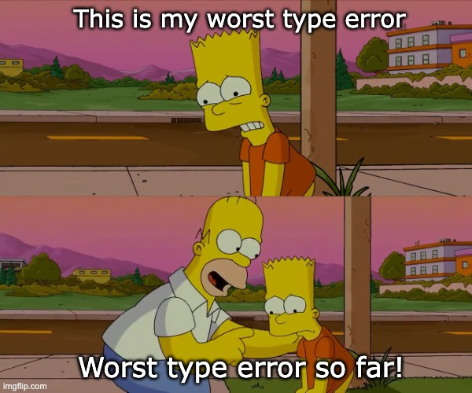

# Matt's Lunch and Learn on Typescript!

This is an interactive lunch and learn with some tips to consider for your typescript development. This also serves as a very basic harness for investigating typescript on a deeper level. I've purposefully setup the compiler options to be minimial and highly up to date. Consider this a sandbox to learn typescript, play around with the tooling, and check out what typescript emits from the compiler.

## Credits

Below are two fantastic resources for upping your typescript game. Each contributed content to this talk!

- [Effective Typescript](https://effectivetypescript.com/)
- [Matt Pocock](https://twitter.com/mpocock1)

## Getting Started

1. Clone the repo to your local machine
2. Run `npm install`
3. Run `npm run tip<NUMBER>` to run a file with a tip

## Meta-documentation

Each file will be labeled `tip_<NUMBER>.ts` starting with 1 and ending with 8. This will be where the content of my talk is. I've also included written documentation with an explainer. I wanted this to be a live exercise where the proof is in the pudding. Play with the code, figure out what you like and don't about these tips and incorporate the feedback accordingly.

## How to stand up a basic typescript codebase

1. Create a directory `mkdir app_name`
2. Create a package.json file `npm init -y`
3. Install typescript and node types (second is optional) `npm i -D typescript @types/node`
4. Generate a tsconfig.json `npx tsc -init`

## Running the code

### Executing

Each tip has an executable script in the package.json. Simply run `npm run exe:tip_<number>` to run a particular file with ts-node.

e.x. `npm run exe:tip_1`

### Building

You can build all the files into executable javascript by running `npm run build` this will place all the compiled javascript into the `build` folder.

## Content

### Tip 1: Play with the TS compiler and look at the output!

The typescript compiler is a fantastic tool to lean on when building typescript. However, it is simply another tool in the developer's toolbox. Let's take a look at a sample input and output to see what the compiler takes in and what it spits out. This can help us wrap our head around what our tools adds to the development experience.

### Tip 2: Understand the Type and Value Spaces

Typescript has two different spaces that it effectively operates in. The type space is descriptions of what data is, and the value space is the actual values our program works with.

### Tip 3: Structural Typing

Structural typing or understanding the shape of data is key to how typescript works. Structural typing allows you to write code that can conform to contracts without requiring strict type annotations. Here we will see how different types can be used within the same function due to similar signatures, but this can backfire sometimes! Let's check that behavior out.

### Tip 4: Use unkown over any. Minimize any usage.

`any` and `unknown` are birds of a feather. Here we'll see how `any` can introduce issues into your code by effectively telling the compiler to not worry about a particular variables type. Then we'll use unknown to help determine the shape of a variable through typeguards.

### Tip 5: Knowing when to use interfaces and types

Interfaces and types are both ways to constrain the value of a particular variable. This section shows you some techniques for using each, and helps try to clarify when to use one over the other.

### Tip 6: Typing function expressions

This is a quick tip on how you can use a type to quickly type a set of function expressions that may have common inputs and outputs!

### Tip 7: Utility types and using readonly

This section covers usage of different helpful utility types. These can help modify contracts, prevent mutation, and modify set unions. Utility types help us easily transform the shape or structure of data to make it easier to work with.

### Tip 8: Minimize over annotation

This tip highlights that like with everything in software there are caveats to implementation choices. The sample itself is typescript that executes. However, it has a lot of additional typing that could be considered an over-indulgence. We can clean this sample up by allowing our IDE to do type inference on return types of functions. Reducing the type alias for function expressions, and returning without variable declarations.
